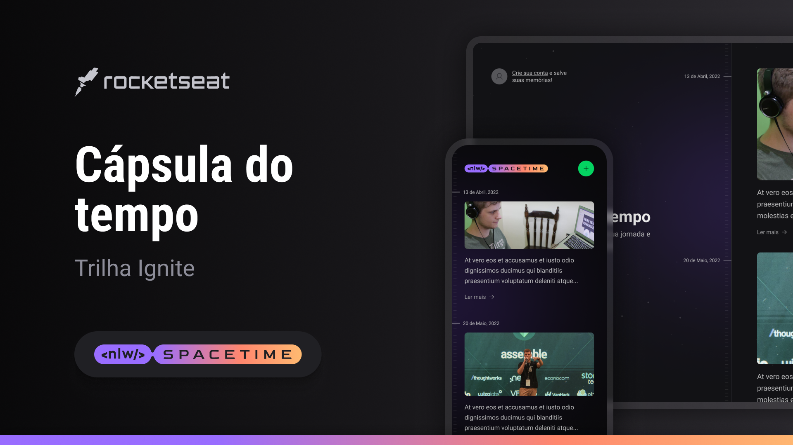

<p align="center">
  
</p>

<!-- <p align="center">
  <a href="#-tecnologias">Tecnologias</a>&nbsp;&nbsp;&nbsp;|&nbsp;&nbsp;&nbsp;
  <a href="#-layout">Layout</a>&nbsp;&nbsp;&nbsp;|&nbsp;&nbsp;&nbsp;
  <a href="#memo-licença">Licença</a>
</p> -->

# NLW - Spacetime

Bem-vindo(a) à Cápsula do Tempo (Spacetime), um projeto que permite armazenar e reviver suas memórias e lembranças especiais.

## ⌛ Descrição

A Cápsula do Tempo é uma aplicação web e mobile que permite aos usuários armazenar e visualizar suas memórias e lembranças. O projeto foi desenvolvido utilizando NextJS para o front-end, Node.js com Fastify para o back-end e React Native para a versão mobile. Os usuários podem fazer login utilizando suas contas do GitHub, acessar todas as suas memórias existentes e cadastrar novas memórias. 

Esse projeto faz parte da NLW Spacetime trilha Ignite, promovido pela RocketSeat em Maio de 2023.


## 🚀 Principais Funcionalidades

- Login via GitHub para autenticação segura.
- Visualização de todas as memórias cadastradas pelo usuário.
- Cadastro de novas memórias, incluindo texto e fotos.

## ⏰ Futuras Funcionalidades

- Página de exibição de cada memória
- Edição da memória
- Layout Responsivo para a Web
- Personalização da data e hora da memória
- Compartilhamento de memórias com amigos e familiares.
- Pesquisa avançada para encontrar memórias específicas, através de palavra-chave ou filtros (por data, por localização, pessoas envolvidas)
- Notificações e lembretes para eventos importantes.
- Suporte a outros métodos de login: Google, Facebook e Twitter
- Marcar outras pessoas na memória
- Possibilitar a adição de vídeos na memória

## ⚠️ Requisitos para a instalação
```
## Para ver a versão do node:
node -v
```

```
## Para ver a versão do yarn:
yarn -v
```

É necessário que você tenha em sua máquina uma versão do **node >= 18** e a do **yarn >= 1**. Caso não possua algum desses dois requisitos, você poderá seguir o passo a passo para a instalação nos links abaixo:

[Como instalar o node em qualquer sistema operacional](https://efficient-sloth-d85.notion.site/Instalando-o-Node-js-d40fdabe8f0a491eb33b85da93d90a2f)

[Como instalar o yarn em qualquer sistema operacional](https://efficient-sloth-d85.notion.site/Instalando-o-Yarn-eca6a13be5b3467d8d2f7be15c60f322)

É necessário fazer a instalação de alguns plugins para o VSCode, com o intuito de facilitar na hora do desenvolvimento:

[ESLint](https://marketplace.visualstudio.com/items?itemName=dbaeumer.vscode-eslint)

[PostCSS Language Support](https://marketplace.visualstudio.com/items?itemName=csstools.postcss)

[Tailwind CSS IntelliSense](https://marketplace.visualstudio.com/items?itemName=bradlc.vscode-tailwindcss)

## 👣 Passo a passo para rodar o projeto em sua máquina

1 - Para clonar o projeto:
```
git clone git@github.com:joaoD3V/nlw-spacetime.git
```

### Para rodar o projeto web

1 - Para instalar as dependências do projeto:
```
yarn install
```
2 - Para rodar o projeto:
```
yarn dev
```

### Para rodar o projeto server
1 - Para instalar as dependências do projeto:
```
yarn install
```
2 - Para rodar o projeto:
```
yarn dev
```

### Para rodar o projeto mobile
1 - Para instalar as dependências do projeto:
```
yarn install
```
2 - Para rodar o projeto:
```
yarn start
```


## 👀 Observações
- Caso queria rodar o projeto na sua máquina, entre em contato comigo: joao.devweb@gmail.com
- Será necessário a configuração do projeto no Developer Settings do Github. Essas configuração são passadas pelas variáveis de ambiente.
- Será necessário que você troque o IP da máquina que foi informado para que fique de acordo com o IP da sua máquina


## 🎨 Layout:

[Clique aqui para ver o layout no Figma](https://www.figma.com/file/SQjBMLyKfKzjnJEqsiktnA/C%C3%A1psula-do-tempo-%E2%80%A2-Trilha-Ignite-(Community)-(Copy)?type=design&node-id=205-85&t=xSXbdBQdBr0taKsR-0)

## :memo: Licença

Este projeto está licenciado sob a [MIT License](https://opensource.org/licenses/MIT).

---

Feito com ♥ by joaoD3V

